# Curiosity Blog

This is a blog that i made with Laravel 8. I made this for learning purposes and you can use this for template or something else. Feel free to fork this repository!

## ⚠️ Warning : Work In Progress 
Until further notice / commit to this repository, current files in this repository remains as default Laravel 8 project.
